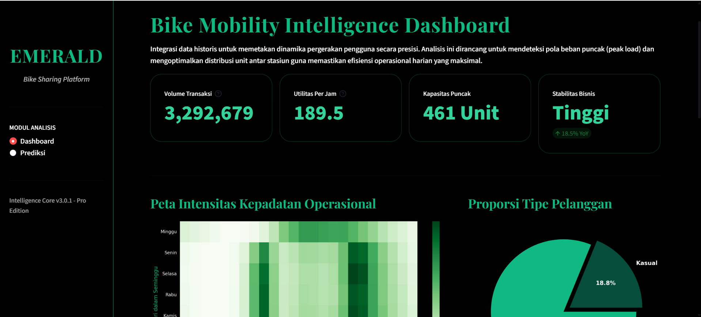
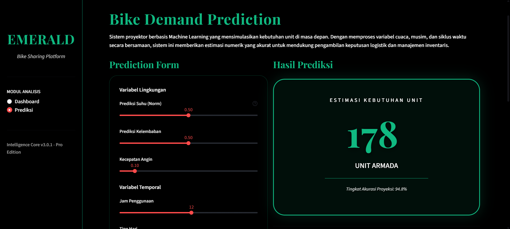

# Bike Sharing Data Analysis Dashboard

## Deskripsi
Proyek ini bertujuan untuk melakukan analisis data pada dataset Bike Sharing untuk menemukan pola penggunaan sepeda berdasarkan waktu, cuaca, dan tipe pengguna.

## Dataset
Dataset yang digunakan berasal dari Kaggle yang berisi data penyewaan sepeda per jam dan per hari.

## Cara Menjalankan Dashboard
1. Pastikan Python sudah terinstal.
2. Clone repository ini atau download filenya.
3. Instal library yang dibutuhkan:
   ```bash
   pip install -r requirements.txt
4. Jalankan aplikasi Streamlit:
    ```bash
    streamlit run dashboard.py

## Kesimpulan
- Strategi Operasional: Perusahaan harus fokus pada pemeliharaan armada di malam hari agar siap digunakan pada jam sibuk (08:00) hari kerja.
- Faktor Cuaca: Suhu dan kelembaban adalah faktor penentu. Promo "diskon cuaca panas" mungkin tidak efektif, namun promo "diskon hari mendung" bisa memicu orang tetap bersepeda.
- Segmen Pengguna: Pengguna Terdaftar adalah tulang punggung bisnis. Sistem langganan bulanan/tahunan sangat disarankan untuk mempertahankan mereka.
- Peluang Ekspansi: Pertumbuhan dari 2011 ke 2012 sangat positif, menandakan model bisnis ini diterima dengan baik oleh masyarakat kota.

## Screenshot Dashboard

